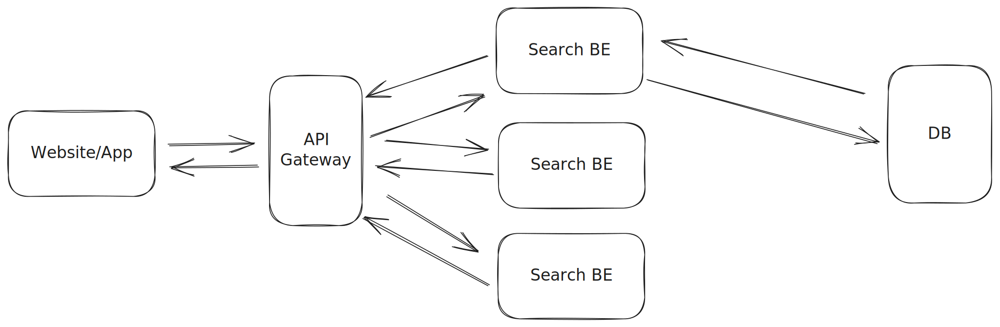

# Proximity Service

### Functional Requirements

1. Who are our end users? two sides: toB and toC
2. Serving side and ingestion side.
3. What is the search radius? What's the maximum radius allow?
4. How instantly do we want to update the business information

### Non-functional Requirements

1. Highly available
2. Low latency
3. consistency requirements?
4. Read > write

### APIs

```
GET v1/places?longitude=xxx&latitude=xxx&radius=xxx
```

Response:

\[business1, business2, business3 ...]

### Data Schema

#### Design Options

***

**Option 1: Store the business with only longitude and latitude**

Plain query over longitude and latitude for:

```
user_longitude-radius <= longitude <= user_longitude+radius
user_latitude-radius <= latitude <= user_latitude+radius
```

***

**Option 2: Evenly divided grid**

Segment the entire map into number of evenly divided grid.

Query -> We will just look for the segment that user location belongs to.

Pros:

* More efficient compared to option 1.

Cons:

* For each grid, there might be unevenly distributed number of businesses.
* If user zoom in/out, this is not very flexible to show number of businesses at different zoom level.

***

**Option 3: Geohashing**

Reducing the two-dimensional longitude and latitude data into one-dimensional string of letters and digits. Recursively dividing the world into smaller and smaller grids with each additional bit.

Pros:

* Very efficient and can fit any precision use cases.
* Not very straightforward to implement but luckily we have a lot of out-of-box libraries/solutions.

***

#### Business Table

| Column    | Type   |
| --------- | ------ |
| id        | string |
| name      | string |
| longitude | float  |
| latitude  | float  |
| geohash   | string |

#### Serving Algorithm

1. Convert user's location to a geohash with a precision based on the radius.
2. Query for businesses with geohashes that start with the same prefix as the user's location.
3. Filter these results by calculating distance between each business to user's location and only keep businesses that are within the search radius.
4. Search the adjacent geohashes to the user's location to avoid missing any businesses from other geohashes.


### High Level Diagram



### TODO List

* [ ] When new business info get added, how to compute geohash and store it?
* [ ] For evenly divided grid, how about we store evenly grid on multiple precision?
* [ ] QuadTree and Google S2.
* [ ] How to use cache and set cache key
* [ ] Modify the high level diagram.
