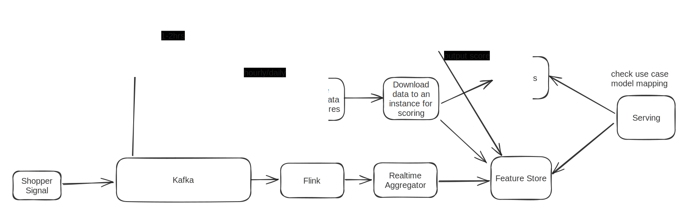

# Top K / Ad Click Aggregation

Q:

1.  How are those ad click events stored and fetched?

    Log file located in different servers and events are append to the end of the file.&#x20;

```
ad_id, click_timestamp, user_id, ip, country
```

2. How much is the scale of the system? \
   1B ad clicks per day, 2M ads in total. Number of ad click events grows 30% year over year.
3. How often do we update it and how real time do we want the ad click report to be? Say an ad click is made 5 mins ago, how soon we want it to reflect in the aggregation?\
   A few minutes of end-to-end latency for ad click aggregation.\
   Real-time bidding less than a second.

## Functional Requirements:

1. Aggregate the number of clicks of ad\_id in the last M minutes.
2. Return the top 100 most clicked ad\_id every minute.
3. Support aggregation filtering by different attributes.

## Non-functional Requirements

1. Highly available
2. Highly scalable
3. Low latency, real-time experience
4. Properly handle delayed or duplicate events.

## Scale

1B users, 2 clicks a day = 2B clicks a day.

10^9\*2 / 10^5 = 2\*10^4 = 20000 QPS.

Peak ad click QPS = 20000 \* 5 = 100000 QPS

Assume a single ad click event occupies 0.1KB storage. Daily storage requirement is 0.1KB \* 1B = 100GB

## API

Aggregate the number of clicks of ad\_id in the last M minutes\
GET /v1/ads/{:ad\_id}/aggregated\_count

Return top N most clicked ad\_ids in the last M minutes\
GET /v1/ads/popular\_ads

## Data Schema

Raw data

<table><thead><tr><th width="95">ad_id</th><th width="159">click_timestamp</th><th width="149">user_id</th><th width="239">ip</th><th>country</th></tr></thead><tbody><tr><td></td><td></td><td></td><td></td><td></td></tr></tbody></table>

Aggregated data

| ad\_id | click\_minute | count |
| ------ | ------------- | ----- |
|        |               |       |

Write load is heavy so use NoSQL like Cassandra or time series DB like influxDB

## High Level Design


